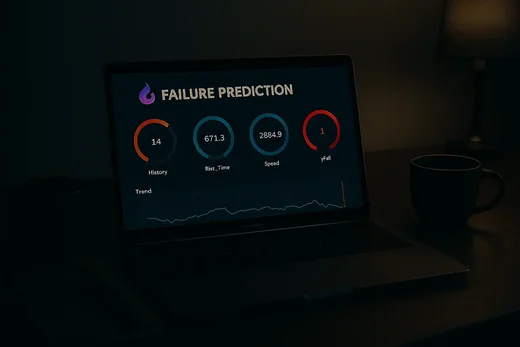
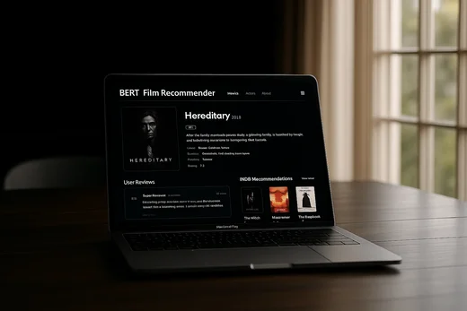
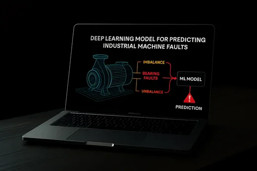
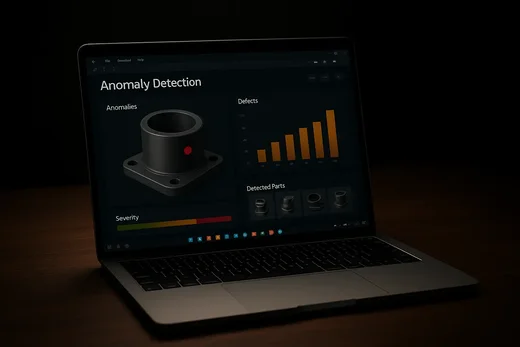
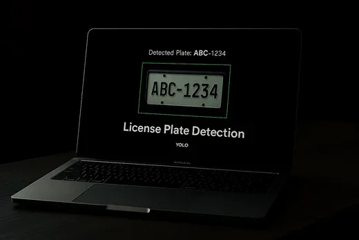
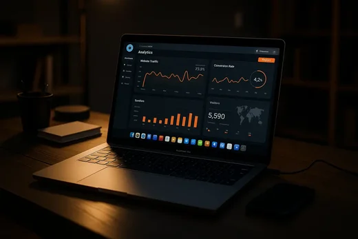
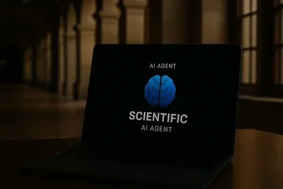
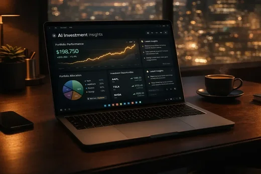

# Sidnei Almeida

**AI Engineer focused on Machine Learning, Computer Vision and Data Systems**

Practical AI and data systems across the full path: modeling, vision pipelines, data paths, APIs, dashboards, deployment and grounded LLM workflows when retrieval matters.

 

 

&nbsp;&nbsp;

  

 

 

## About

I work where **models meet systems**: datasets you can trust, training and evaluation you can defend, and surfaces people actually use (**FastAPI**, **Streamlit**, web-style UI when needed, hosted demos).

That usually means **computer vision** (detection, classification, **ALPR-style** stacks, paths toward **real-time inference**), **tabular ML**, **ETL and analytical products**, plus **RAG and LLM integrations** when answers need grounded documents or orchestration across APIs (**Groq**, **Gemini**, **Ollama**, and similar).

Background blends management and quantitative study; what matters here is **build quality**, reproducibility and clarity under constraints, not generic slide decks.

 

## Core focus

<table>
<tr>
<td width="50%" valign="top">

**Ship end-to-end**  
Ingestion, validation, features, training, evaluation, packaging.

**Integrate cleanly**  
HTTP APIs, interactive dashboards, lightweight front ends.

**Operate with intent**  
HF Spaces, Pages, Vercel, Firebase, Supabase, GCP, AWS as the problem dictates.

</td>
<td width="50%" valign="top">

**Stay honest on metrics**  
Cross-validation, baselines, error analysis, regime shifts.

**Think in products**  
Structured data paths stakeholders can explore and rerun.

**Compose AI systems**  
RAG, document Q&A, automation flows beyond a single `.ipynb`.

</td>
</tr>
</table>

 

## Technical stack

Grouped by **what I deliver**. Foundation across all pillars: **Python**, **SQL**, **JavaScript**, **Git**, **GitHub**.

<table>
<tr>
<td colspan="2">

### Machine Learning Engineering

Predictive systems on structured data: **scikit-learn**, **XGBoost**, **classification**, **regression**, **clustering**, **feature engineering**, **cross-validation**, disciplined **model evaluation** and **predictive modeling** so comparisons stay grounded.

</td>
</tr>
<tr>
<td colspan="2">

### Deep Learning & Computer Vision

**TensorFlow / Keras**, **PyTorch**, **transfer learning**, **VGG16**, **autoencoders**, **LSTM** when sequences carry signal, **YOLOv8**, **OpenCV**, **object detection**, **image classification**, **ALPR / license plate recognition**, **real-time inference** workflows where hardware and latency allow.

</td>
</tr>
<tr>
<td width="50%" valign="top">

### Data Engineering & Analytics

**Pandas**, **NumPy**, **preprocessing**, **ETL**, **CSV**, **Excel**, **SQLite**, structured pipelines, **dashboards** and analytical apps that make slices of the data legible.

</td>
<td width="50%" valign="top">

### APIs, Apps & Deployment

**FastAPI**, **Streamlit**, **HTML**, **CSS**, **JavaScript**, **API-first ML demos**, interactive dashboards, shipping via **Hugging Face Spaces**, **GitHub Pages**, **Vercel**, **Firebase**, **Supabase**, **GCP**, **AWS**.

</td>
</tr>
<tr>
<td colspan="2">

### AI Systems & Automation

**RAG**, **document Q&A**, **local models with Ollama**, **Groq** and **Gemini** API integrations, **AI automation workflows** that combine retrieval, tools and guardrails instead of one-off prompts.

</td>
</tr>
</table>

 

## Featured projects

Preview thumbnails live **in this repo** under `assets/readme/projects/` (exported from my GitHub Pages image assets and resized for lighter loads). Full demos stay on **[sidnei-almeida.github.io](https://sidnei-almeida.github.io/)**.

### DocMind · RAG document chatbot (PDF Q&A)

**Problem:** Answer questions over PDFs without manual close reading.  
**Stack:** Retrieval augmented generation, vector search (**FAISS**), **FastAPI**, orchestration with **LangChain**.  
**Result:** Grounded document Q&A pipeline with PDF ingestion and conversational retrieval.  
**Impact:** Cuts research latency for long reports and keeps answers tied to source passages.

[**Repository**](https://github.com/sidnei-almeida/rag-document-chatbot) · [**Live demo**](https://sidnei-almeida.github.io/projects/docmind-chat/docmind-chat.html)

### SECOM industrial anomaly ops · autoencoder monitoring

**Problem:** Spot rare failures in high dimensional semiconductor process signals.  
**Stack:** Neural **autoencoder**, **TensorFlow**, **FastAPI**, telemetry style dashboard over **558** monitored features (**1,567** samples in the shipped dataset slice).  
**Result:** Reconstruction-based anomaly scoring with adjustable thresholding (portfolio default **0.45**) and live monitoring loop.  
**Impact:** Turns reconstruction error into an operational signal for engineers instead of static batch plots.

[**Repository**](https://github.com/sidnei-almeida/secom_failure_prediction) · [**Live demo**](https://sidnei-almeida.github.io/projects/secom-anomaly/secom-anomaly.html)

### CineScope · semantic movie recommender (BERT + TMDb)

**Problem:** Recommend titles using meaning, not genre tags alone.  
**Stack:** **BERT** style similarity, **TMDb** metadata and media hooks, semantic search UX.  
**Result:** NLP driven similarity search across plots with richer context than naive filtering.  
**Impact:** Better discovery UX for catalog style experiences and portfolio grade NLP integration.

[**Repository**](https://github.com/sidnei-almeida/tmdb-semantic-recommender) · [**Live demo**](https://sidnei-almeida.github.io/projects/tmdb-cinema/tmdb-cinema.html)

### Predictive maintenance · LSTM on industrial sensor streams

**Problem:** Anticipate equipment failures before hard downtime.  
**Stack:** Multivariate time series, **LSTM**, **TensorFlow**, **FastAPI**, **Plotly** dashboards.  
**Result:** **95.2%** test accuracy with **7** industrial sensor channels modeled end to end.  
**Impact:** Moves maintenance from reactive tickets to proactive scheduling backed by monitored signals.

[**Repository**](https://github.com/sidnei-almeida/manutencao_preditiva_lstm) · [**Live demo**](https://sidnei-almeida.github.io/projects/predictive-maintenance/predictive-maintenance.html)

### Visual defect detection · U-Net segmentation (MVTec AD)

**Problem:** Automate visual QC on industrial products with pixel level cues.  
**Stack:** **U-Net** segmentation, **PyTorch**, **OpenCV**, **Anomalib**, MVTec AD style defect framing.  
**Result:** Deep learning inspection workflow tuned for consistent segmentation based QC.  
**Impact:** Reduces manual inspection load and stabilizes pass fail decisions across batches.

[**Repository**](https://github.com/sidnei-almeida/anomaly_detection_anomalib) · [**Live demo**](https://sidnei-almeida.github.io/projects/bottle-anomaly-detection/bottle-anomaly-detection.html)

### Brazilian ALPR · real time Mercosul plates

**Problem:** Read Brazilian and Mercosul plates in the wild for monitoring or access flows.  
**Stack:** **YOLOv8**, **OpenCV**, OCR style decoding stages, **FastAPI**, **PyTorch**.  
**Result:** **Precision 99.69%**, **Recall 99.19%**, **mAP@50 99.49%** on the documented detector setup.  
**Impact:** End to end ALPR suitable for camera feeds, gates or analytics pipelines, not toy snapshots.

[**Repository**](https://github.com/sidnei-almeida/brazilian-license-plate-recognition) · [**Live demo**](https://sidnei-almeida.github.io/projects/license-plate-detection/license-plate-detection.html)

### FluxForecast · offshore riser flow prediction (LSTM telemetry)

**Problem:** Monitor and forecast liquid flow regimes using multi sensor riser telemetry.  
**Stack:** **LSTM**, **FastAPI**, streamed visualization, **7** normalized pressure channels, **7,074** scaled samples, **P05/P95** anomaly shading on the live demo.  
**Result:** Near real time forecasting view with statistical envelope cues for drift.  
**Impact:** Demonstrates production shaped time series UX for energy style operations teams.

[**Repository**](https://github.com/sidnei-almeida/virtual_flow_forecasting) · [**Live demo**](https://sidnei-almeida.github.io/projects/fluxforecast/fluxforecast.html)

### Autonomous Research System · multi agent LLM orchestration

**Problem:** Automate structured literature style research across sources with guardrails.  
**Stack:** **LangGraph**, **LangChain**, **Groq**, retrieval tooling, ArXiv oriented flows per portfolio copy.  
**Result:** Multi agent planning, tool use and synthesis with session memory across turns.  
**Impact:** Shows agentic LLM engineering beyond a single chat box: orchestration, retrieval and UX.

[**Code (portfolio subtree)**](https://github.com/sidnei-almeida/sidnei-almeida.github.io/tree/main/projects/research-agent) · [**Live demo**](https://sidnei-almeida.github.io/projects/research-agent/research-agent.html)

### Quant Core · deep RL trading cockpit

**Problem:** Give operators a disciplined dashboard around RL driven trading experiments.  
**Stack:** Deep reinforcement learning agents, **FastAPI**, JavaScript UI, broker API hooks (Binance, Alpaca, Bybit per portfolio), guard rails and emergency controls.  
**Result:** Live balances, positions, logs and agent controls in one surface.  
**Impact:** Highlights ML systems thinking: instrumentation, risk limits and operational toggles, not only model.fit.

[**Code (portfolio subtree)**](https://github.com/sidnei-almeida/sidnei-almeida.github.io/tree/main/projects/quant-core) · [**Live demo**](https://sidnei-almeida.github.io/projects/quant-core/quant-core.html)

Additional builds such as DogBreed Vision, facial emotion classification, corporate growth scoring and the Universal Data Translator remain available as repositories; browse the full archive on the portfolio projects page.

 

## Engineering approach

| Step | What I optimize for |
| :--- | :--- |
| **1. Frame** | Outcomes, latency budgets, drift risk, labeling cost, how humans consume outputs. |
| **2. Land data** | Schemas, leakage, reconciliation, repeatable ingestion. |
| **3. Transform** | Features and cleaners that match **train** and **inference** payloads. |
| **4. Train & evaluate** | Baselines first, metrics aligned with failure modes, slices that stress edge cases. |
| **5. Wire up** | Thin **FastAPI** services, **Streamlit** or web demos, contracts that are easy to test. |
| **6. Ship & iterate** | **HF Spaces**, **Pages**, **Vercel**, **Firebase**, **Supabase**, **GCP**, **AWS**; observe, patch data, refresh models. |

 

## GitHub activity

  

 

### Open to work that connects modeling, data paths and deployment

AI engineering and machine learning engineering roles, plus collaborations where **APIs**, **dashboards** and **hosted surfaces** are first-class, not an appendix.

 

 

<i>Caxias do Sul, Brazil · remote-friendly</i>

