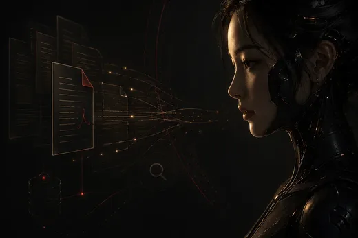
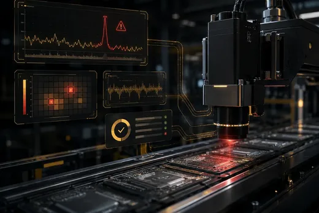
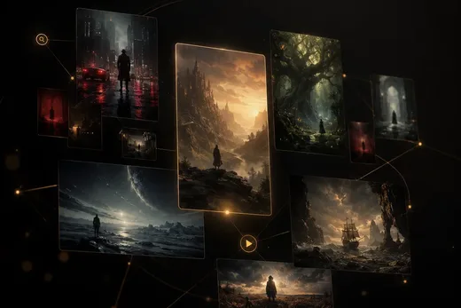
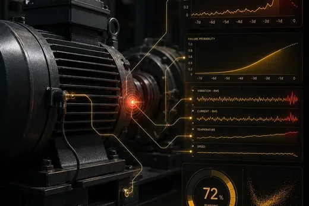
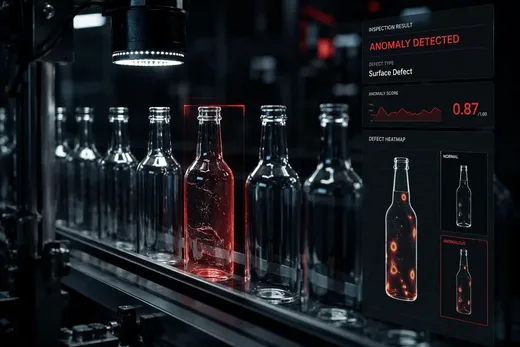
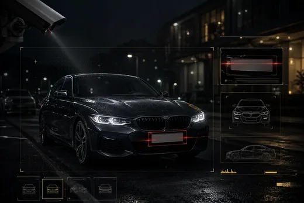
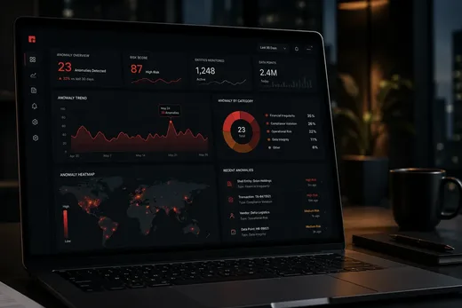
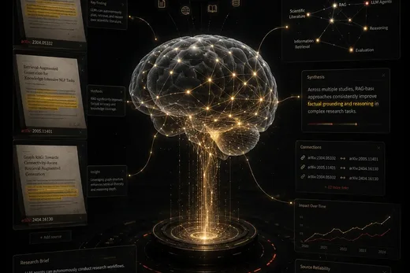
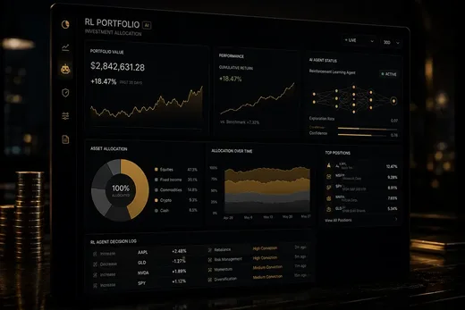

# Sidnei Almeida

**AI Engineer focused on Machine Learning, Computer Vision and Data Systems**

Practical AI and data systems across the full path: modeling, vision pipelines, data paths, APIs, dashboards, deployment and grounded LLM workflows when retrieval matters.

 

 

&nbsp;&nbsp;

  

 

 

## About

I work where **models meet systems**: datasets you can trust, training and evaluation you can defend, and surfaces people actually use (**FastAPI**, **Streamlit**, web-style UI when needed, hosted demos).

That usually means **computer vision** (detection, classification, **ALPR-style** stacks, paths toward **real-time inference**), **tabular ML**, **ETL and analytical products**, plus **RAG and LLM integrations** when answers need grounded documents or orchestration across APIs (**Groq**, **Gemini**, **Ollama**, and similar).

Background blends management and quantitative study; what matters here is **build quality**, reproducibility and clarity under constraints, not generic slide decks.

 

## Core focus

<table>
<tr>
<td width="50%" valign="top">

**Ship end-to-end**  
Ingestion, validation, features, training, evaluation, packaging.

**Integrate cleanly**  
HTTP APIs, interactive dashboards, lightweight front ends.

**Operate with intent**  
HF Spaces, Pages, Vercel, Firebase, Supabase, GCP, AWS as the problem dictates.

</td>
<td width="50%" valign="top">

**Stay honest on metrics**  
Cross-validation, baselines, error analysis, regime shifts.

**Think in products**  
Structured data paths stakeholders can explore and rerun.

**Compose AI systems**  
RAG, document Q&A, automation flows beyond a single `.ipynb`.

</td>
</tr>
</table>

 

## Technical stack

Grouped by **what I deliver**. Foundation across all pillars: **Python**, **SQL**, **JavaScript**, **Git**, **GitHub**.

<table>
<tr>
<td colspan="2">

### Machine Learning Engineering

Predictive systems on structured data: **scikit-learn**, **XGBoost**, **classification**, **regression**, **clustering**, **feature engineering**, **cross-validation**, disciplined **model evaluation** and **predictive modeling** so comparisons stay grounded.

</td>
</tr>
<tr>
<td colspan="2">

### Deep Learning & Computer Vision

**TensorFlow / Keras**, **PyTorch**, **transfer learning**, **VGG16**, **autoencoders**, **LSTM** when sequences carry signal, **YOLOv8**, **OpenCV**, **object detection**, **image classification**, **ALPR / license plate recognition**, **real-time inference** workflows where hardware and latency allow.

</td>
</tr>
<tr>
<td width="50%" valign="top">

### Data Engineering & Analytics

**Pandas**, **NumPy**, **preprocessing**, **ETL**, **CSV**, **Excel**, **SQLite**, structured pipelines, **dashboards** and analytical apps that make slices of the data legible.

</td>
<td width="50%" valign="top">

### APIs, Apps & Deployment

**FastAPI**, **Streamlit**, **HTML**, **CSS**, **JavaScript**, **API-first ML demos**, interactive dashboards, shipping via **Hugging Face Spaces**, **GitHub Pages**, **Vercel**, **Firebase**, **Supabase**, **GCP**, **AWS**.

</td>
</tr>
<tr>
<td colspan="2">

### AI Systems & Automation

**RAG**, **document Q&A**, **local models with Ollama**, **Groq** and **Gemini** API integrations, **AI automation workflows** that combine retrieval, tools and guardrails instead of one-off prompts.

</td>
</tr>
</table>

 

## Featured projects

Preview thumbnails live **in this repo** under `assets/readme/projects/` (exported from the portfolio site assets and resized for lighter loads). Live demos link directly to each hosted app; the full grid is on **[sidnei-almeida.github.io/projects](https://sidnei-almeida.github.io/projects)**.

### DocMind — RAG Document QA Assistant

**Problem:** Answer questions over PDFs with evidence grounded in the source document.  
**Stack:** **React**, **FastAPI**, **FAISS**, **LangChain**, **Groq** — ingestion, chunking, retrieval and source-grounded Q&A.  
**Result:** Full document intelligence workflow: workspace status, retrieved passages, confidence metadata and polished UI.  
**Impact:** Cuts research latency on long reports while keeping answers tied to citations.

[**Repository**](https://github.com/sidnei-almeida/rag-document-qa-assistant) · [**Live demo**](https://rag-document-qa-assistant.vercel.app/)

### Real-Time Industrial Anomaly Monitor

**Problem:** Surface rare failures in high-dimensional semiconductor process telemetry before they escalate.  
**Stack:** **Next.js** ops UI, **FastAPI** autoencoder on Hugging Face, SECOM-style replay as a simulated live sensor stream.  
**Result:** Reconstruction-based anomaly scoring, threshold alerts and production-inspired monitoring — not a static notebook plot.  
**Impact:** Turns reconstruction error into an operational signal engineers can watch in real time.

[**Repository**](https://github.com/sidnei-almeida/industrial-iot-anomaly-monitor) · [**Live demo**](https://industrial-iot-anomaly-monitor.vercel.app/)

### CineScope Intelligence

**Problem:** Discover films by theme, mood, cast or story — not genre tags alone.  
**Stack:** **BERT** semantic recommendations, **TMDb** enrichment (posters, trailers, cast), **React** + **FastAPI**.  
**Result:** Featured titles, match scores, recommendation grid and cinematic product UX.  
**Impact:** Portfolio-grade NLP integration with real API orchestration and ranking.

[**Repository**](https://github.com/sidnei-almeida/tmdb-semantic-recommender) · [**Live demo**](https://cinescope-semantic-discovery.vercel.app/)

### PM Monitor · Real-Time Predictive Maintenance

**Problem:** Anticipate equipment failure risk from multivariate sensor streams before hard downtime.  
**Stack:** Rolling **LSTM** sequences, **TensorFlow**, **FastAPI**, control-room **React** dashboard.  
**Result:** Live telemetry replay, failure probability, asset health, thresholds and event logs.  
**Impact:** Moves maintenance from reactive tickets to monitored, sequence-based risk signals.

[**Repository**](https://github.com/sidnei-almeida/lstm-predictive-maintenance-dashboard) · [**Live demo**](https://lstm-predictive-maintenance-dashboa.vercel.app/)

### Visual Anomaly Comparison Lab

**Problem:** Inspect industrial bottle samples with interpretable visual anomaly cues.  
**Stack:** Denoising convolutional **autoencoder** (**PyTorch**), **FastAPI**, **React** side-by-side comparison UI.  
**Result:** Original vs reconstruction, error heatmaps, masks, scores and thresholded regions.  
**Impact:** QC workflow that explains *why* a sample looks anomalous, not only a single score.

[**Repository**](https://github.com/sidnei-almeida/visual-anomaly-comparison-lab) · [**Live demo**](https://visual-anomaly-comparison-lab.vercel.app/)

### PlatePulse Vehicle Intelligence

**Problem:** Detect and read Brazilian license plates in vehicle images for monitoring or access flows.  
**Stack:** Two-stage pipeline — **YOLOv8** plate detection API, crop, then **OCR/ALPR** API; **React** control-room UI.  
**Result:** Bounding boxes, plate crop, OCR text, confidence, pipeline status and export hooks.  
**Impact:** End-to-end ALPR product surface, not a single-model notebook snapshot.

[**Repository**](https://github.com/sidnei-almeida/platepulse-vehicle-intelligence) · [**Live demo**](https://platepulse-vehicle-intelligence.vercel.app/)

### Corporate Signal Intelligence

**Problem:** Monitor public companies and flag anomalous events across financial and operational signals.  
**Stack:** **FastAPI**, **Isolation Forest**, **PostgreSQL/Neon**, **Next.js**, Groq executive briefings (Llama 3.3 70B).  
**Result:** Overview, anomaly investigation, company intelligence and AI-generated executive summaries.  
**Impact:** End-to-end corporate analytics product, not a single-chart dashboard.

[**Repository**](https://github.com/sidnei-almeida/corporate-signal-intelligence-dashboard) · [**Live demo**](https://corporate-signal-intelligence-dashb.vercel.app/)

### Gray Matter LABS

**Problem:** Run structured research sessions with scientific tools, not a single generic chat box.  
**Stack:** **React** workspace, **Groq**, arXiv discovery, web and Wikipedia tools, multi-conversation memory.  
**Result:** Tool-aware responses with a lab-inspired UX and local chat history.  
**Impact:** Shows agentic LLM product design: orchestration, retrieval hooks and deliberate persona.

[**Repository**](https://github.com/sidnei-almeida/gray-matter-research-agent) · [**Live demo**](https://gray-matter-research-agent.vercel.app/)

### RL Portfolio Allocation Dashboard

**Problem:** Explore PPO-based allocation policies with risk guardrails and readable market analytics.  
**Stack:** **PPO** policy inference, **FastAPI**, **Next.js**, Stooq historical replay, simulated paper trading.  
**Result:** Conservative / Balanced / Aggressive modes, exposure view, benchmarks and execution feed (no live broker).  
**Impact:** Highlights ML systems thinking: guardrails, instrumentation and operator-facing controls.

[**Repository**](https://github.com/sidnei-almeida/ai-trading-signals-dashboard) · [**Live demo**](https://ai-trading-signals-dashboard.vercel.app/)

Older experiments and additional repositories remain on GitHub; the curated portfolio grid (9 shipped demos) lives at <a href="https://sidnei-almeida.github.io/projects">sidnei-almeida.github.io/projects</a>.

 

## Engineering approach

| Step | What I optimize for |
| :--- | :--- |
| **1. Frame** | Outcomes, latency budgets, drift risk, labeling cost, how humans consume outputs. |
| **2. Land data** | Schemas, leakage, reconciliation, repeatable ingestion. |
| **3. Transform** | Features and cleaners that match **train** and **inference** payloads. |
| **4. Train & evaluate** | Baselines first, metrics aligned with failure modes, slices that stress edge cases. |
| **5. Wire up** | Thin **FastAPI** services, **Streamlit** or web demos, contracts that are easy to test. |
| **6. Ship & iterate** | **HF Spaces**, **Pages**, **Vercel**, **Firebase**, **Supabase**, **GCP**, **AWS**; observe, patch data, refresh models. |

 

## GitHub activity

  

 

### Open to work that connects modeling, data paths and deployment

AI engineering and machine learning engineering roles, plus collaborations where **APIs**, **dashboards** and **hosted surfaces** are first-class, not an appendix.

 

 

<i>Caxias do Sul, Brazil · remote-friendly</i>

