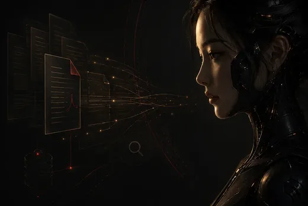
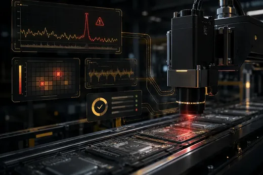
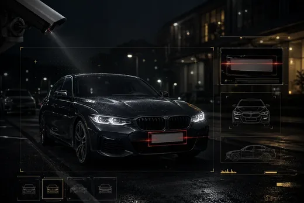
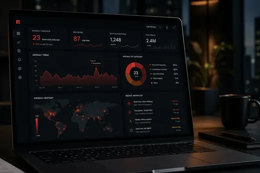
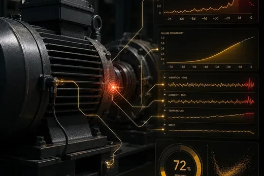
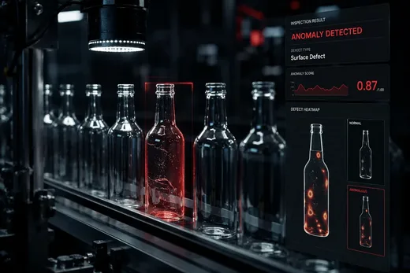
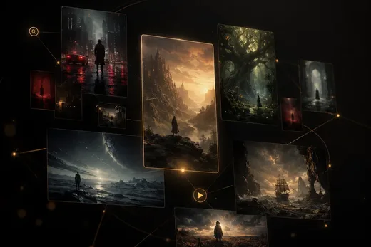
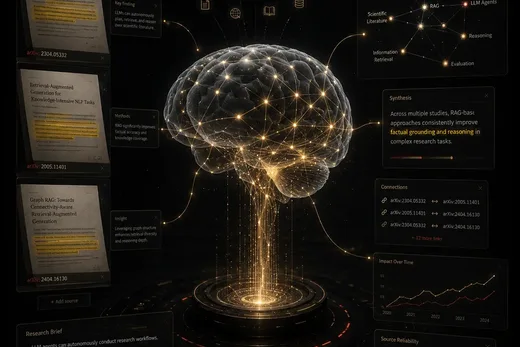
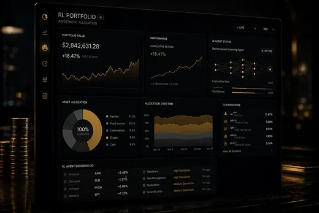

# Sidnei Almeida

**AI Engineer** · Machine Learning · Computer Vision · Data Systems

Practical AI and data systems across the full path: modeling, vision pipelines, data paths, APIs, dashboards, deployment and grounded LLM workflows when retrieval matters.

 

  

 

 

## About

I work where **models meet systems**: datasets you can trust, training and evaluation you can defend, and surfaces people actually use (**FastAPI**, **React / Next.js**, **Streamlit**, hosted demos).

That usually means **computer vision** (detection, classification, **ALPR-style** stacks, paths toward **real-time inference**), **tabular ML**, **ETL and analytical products**, plus **RAG and LLM integrations** when answers need grounded documents or orchestration across APIs (**Groq**, **Gemini**, **Ollama**, and similar).

Background blends management and quantitative study; what matters here is **build quality**, reproducibility and clarity under constraints.

 

## Core focus

<table>
<tr>
<td width="50%" valign="top">

**Ship end-to-end**  
Ingestion, validation, features, training, evaluation, packaging.

**Integrate cleanly**  
HTTP APIs, interactive dashboards, lightweight front ends.

**Operate with intent**  
HF Spaces, Pages, Vercel, Firebase, Supabase, GCP, AWS as the problem dictates.

</td>
<td width="50%" valign="top">

**Stay honest on metrics**  
Cross-validation, baselines, error analysis, regime shifts.

**Think in products**  
Structured data paths stakeholders can explore and rerun.

**Compose AI systems**  
RAG, document Q&A, automation flows beyond a single `.ipynb`.

</td>
</tr>
</table>

 

## Technical stack

Grouped by **what I deliver**. Foundation across all pillars: **Python**, **SQL**, **JavaScript**, **Git**, **GitHub**.

<table>
<tr>
<td width="50%" valign="top">

### 🧠 Machine Learning Engineering

Predictive systems on structured data: **scikit-learn**, **XGBoost**, classification, regression, clustering, feature engineering, cross-validation and disciplined model evaluation so comparisons stay grounded.

</td>
<td width="50%" valign="top">

### 👁️ Deep Learning & Computer Vision

**PyTorch**, **TensorFlow / Keras**, transfer learning, autoencoders, **LSTM** when sequences carry signal, **YOLOv8**, **OpenCV**, object detection, image classification, **ALPR** and real-time inference workflows.

</td>
</tr>
<tr>
<td width="50%" valign="top">

### 🗄️ Data Engineering & Analytics

**Pandas**, **NumPy**, preprocessing, **ETL**, CSV, Excel, **SQLite**, **PostgreSQL**, structured pipelines and analytical apps that make slices of the data legible.

</td>
<td width="50%" valign="top">

### 🚀 APIs, Apps & Deployment

**FastAPI**, **React / Next.js**, **Streamlit**, API-first ML demos and interactive dashboards, shipped on **Hugging Face Spaces**, **GitHub Pages**, **Vercel**, **Firebase**, **Supabase**, **GCP**, **AWS**.

</td>
</tr>
<tr>
<td colspan="2" valign="top">

### 🤖 AI Systems & Automation

**RAG**, document Q&A, local models with **Ollama**, **Groq** and **Gemini** API integrations, **AI automation workflows** that combine retrieval, tools and guardrails instead of one-off prompts.

</td>
</tr>
</table>

 

## Featured projects

Nine shipped demos, each with a live deployment. Preview thumbnails live in this repo under `assets/readme/projects/`; the full grid is on **[sidnei-almeida.github.io/projects](https://sidnei-almeida.github.io/projects)**.

<table>
<tr>
<td width="280" valign="top">

</td>
<td valign="top">

### DocMind — RAG Document QA Assistant

**Problem** · Answer questions over PDFs with evidence grounded in the source document.  
**Stack** · React, FastAPI, FAISS, LangChain, Groq — ingestion, chunking, retrieval and source-grounded Q&A.  
**Result** · Workspace status, retrieved passages, confidence metadata and a polished UI; cuts research latency on long reports while keeping answers tied to citations.

[**Repository**](https://github.com/sidnei-almeida/rag-document-qa-assistant) · [**Live demo**](https://rag-document-qa-assistant.vercel.app/)

</td>
</tr>

<tr>
<td width="280" valign="top">

</td>
<td valign="top">

### Real-Time Industrial Anomaly Monitor

**Problem** · Surface rare failures in high-dimensional semiconductor process telemetry before they escalate.  
**Stack** · Next.js ops UI, FastAPI autoencoder on Hugging Face, SECOM-style replay as a simulated live sensor stream.  
**Result** · Reconstruction-based scoring and threshold alerts — reconstruction error turned into an operational signal engineers watch in real time.

[**Repository**](https://github.com/sidnei-almeida/industrial-iot-anomaly-monitor) · [**Live demo**](https://industrial-iot-anomaly-monitor.vercel.app/)

</td>
</tr>

<tr>
<td width="280" valign="top">

</td>
<td valign="top">

### PlatePulse Vehicle Intelligence

**Problem** · Detect and read Brazilian license plates in vehicle images for monitoring or access flows.  
**Stack** · Two-stage pipeline — YOLOv8 plate detection API, crop, then OCR/ALPR API; React control-room UI.  
**Result** · Bounding boxes, plate crop, OCR text, confidence and pipeline status: an end-to-end ALPR product surface, not a single-model notebook snapshot.

[**Repository**](https://github.com/sidnei-almeida/platepulse-vehicle-intelligence) · [**Live demo**](https://platepulse-vehicle-intelligence.vercel.app/)

</td>
</tr>

<tr>
<td width="280" valign="top">

</td>
<td valign="top">

### Corporate Signal Intelligence

**Problem** · Monitor public companies and flag anomalous events across financial and operational signals.  
**Stack** · FastAPI, Isolation Forest, PostgreSQL/Neon, Next.js, Groq executive briefings (Llama 3.3 70B).  
**Result** · Overview, anomaly investigation, company intelligence and AI-generated executive summaries — a full analytics product, not a single-chart dashboard.

[**Repository**](https://github.com/sidnei-almeida/corporate-signal-intelligence-dashboard) · [**Live demo**](https://corporate-signal-intelligence-dashb.vercel.app/)

</td>
</tr>
</table>

<b>More shipped projects</b> — five additional live demos

 

<table>
<tr>
<td width="50%" valign="top">

**PM Monitor · Real-Time Predictive Maintenance**

Rolling **LSTM** sequences over multivariate sensor streams: live telemetry replay, failure probability, asset health, thresholds and event logs in a control-room React dashboard.

`LSTM` `TensorFlow` `FastAPI` `React`

[Repository](https://github.com/sidnei-almeida/lstm-predictive-maintenance-dashboard) · [Live demo](https://lstm-predictive-maintenance-dashboa.vercel.app/)

</td>
<td width="50%" valign="top">

**Visual Anomaly Comparison Lab**

Denoising convolutional **autoencoder** for industrial bottle inspection: original vs reconstruction, error heatmaps, masks and thresholded regions that explain *why* a sample looks anomalous.

`PyTorch` `Autoencoder` `OpenCV` `FastAPI`

[Repository](https://github.com/sidnei-almeida/visual-anomaly-comparison-lab) · [Live demo](https://visual-anomaly-comparison-lab.vercel.app/)

</td>
</tr>
<tr>
<td width="50%" valign="top">

**CineScope Intelligence**

**BERT** semantic recommendations with TMDb enrichment (posters, trailers, cast): featured titles, match scores and a recommendation grid — NLP plus real API orchestration and ranking.

`BERT` `TMDb` `React` `FastAPI`

[Repository](https://github.com/sidnei-almeida/tmdb-semantic-recommender) · [Live demo](https://cinescope-semantic-discovery.vercel.app/)

</td>
<td width="50%" valign="top">

**Gray Matter LABS**

Structured research sessions instead of a generic chat box: Groq-backed agent with arXiv discovery, web and Wikipedia tools, multi-conversation memory and a lab-inspired workspace UX.

`React` `Groq` `arXiv` `AI Agent`

[Repository](https://github.com/sidnei-almeida/gray-matter-research-agent) · [Live demo](https://gray-matter-research-agent.vercel.app/)

</td>
</tr>
<tr>
<td width="50%" valign="top">

**RL Portfolio Allocation Dashboard**

**PPO** allocation policies with risk guardrails: Conservative / Balanced / Aggressive modes, exposure view, benchmarks and a simulated execution feed over Stooq historical replay (no live broker).

`PPO` `Next.js` `FastAPI` `Paper trading`

[Repository](https://github.com/sidnei-almeida/ai-trading-signals-dashboard) · [Live demo](https://ai-trading-signals-dashboard.vercel.app/)

</td>
<td width="50%" valign="top">

 

Older experiments and additional repositories remain on GitHub. The curated portfolio grid lives at <a href="https://sidnei-almeida.github.io/projects">sidnei-almeida.github.io/projects</a>.

</td>
</tr>
</table>

 

## Engineering approach

| Step | What I optimize for |
| :--- | :--- |
| **1. Frame** | Outcomes, latency budgets, drift risk, labeling cost, how humans consume outputs. |
| **2. Land data** | Schemas, leakage, reconciliation, repeatable ingestion. |
| **3. Transform** | Features and cleaners that match **train** and **inference** payloads. |
| **4. Train & evaluate** | Baselines first, metrics aligned with failure modes, slices that stress edge cases. |
| **5. Wire up** | Thin **FastAPI** services, **Streamlit** or web demos, contracts that are easy to test. |
| **6. Ship & iterate** | **HF Spaces**, **Pages**, **Vercel**, **Firebase**, **Supabase**, **GCP**, **AWS**; observe, patch data, refresh models. |

 

## GitHub activity

  

Open to AI / ML engineering work — <a href="mailto:sidnei.almeida1806@gmail.com">sidnei.almeida1806@gmail.com</a>

