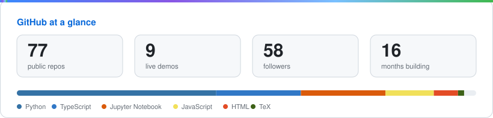

# Sidnei Almeida

**AI Engineer** · Machine Learning · Computer Vision · Data Systems

Practical AI and data systems across the full path: modeling, vision pipelines, data paths, APIs, dashboards, deployment and grounded LLM workflows when retrieval matters.

 

  

 

 

## About

I work where **models meet systems**: datasets you can trust, training and evaluation you can defend, and surfaces people actually use (**FastAPI**, **React / Next.js**, **Streamlit**, hosted demos).

That usually means **computer vision** (detection, classification, **ALPR-style** stacks, paths toward **real-time inference**), **tabular ML**, **ETL and analytical products**, plus **RAG and LLM integrations** when answers need grounded documents or orchestration across APIs (**Groq**, **Gemini**, **Ollama**, and similar).

Background blends management and quantitative study; what matters here is **build quality**, reproducibility and clarity under constraints.

 

## Core focus

<table>
<tr>
<td width="50%" valign="top">

**Ship end-to-end**  
Ingestion, validation, features, training, evaluation, packaging.

**Integrate cleanly**  
HTTP APIs, interactive dashboards, lightweight front ends.

**Operate with intent**  
HF Spaces, Pages, Vercel, Firebase, Supabase, GCP, AWS as the problem dictates.

</td>
<td width="50%" valign="top">

**Stay honest on metrics**  
Cross-validation, baselines, error analysis, regime shifts.

**Think in products**  
Structured data paths stakeholders can explore and rerun.

**Compose AI systems**  
RAG, document Q&A, automation flows beyond a single `.ipynb`.

</td>
</tr>
</table>

 

## Technical stack

Grouped by **what I deliver**. Foundation across all pillars: **Python**, **SQL**, **JavaScript**, **Git**, **GitHub**.

<table>
<tr>
<td width="50%" valign="top">

### 🧠 Machine Learning Engineering

Predictive systems on structured data: **scikit-learn**, **XGBoost**, classification, regression, clustering, feature engineering, cross-validation and disciplined model evaluation so comparisons stay grounded.

</td>
<td width="50%" valign="top">

### 👁️ Deep Learning & Computer Vision

**PyTorch**, **TensorFlow / Keras**, transfer learning, autoencoders, **LSTM** when sequences carry signal, **YOLOv8**, **OpenCV**, object detection, image classification, **ALPR** and real-time inference workflows.

</td>
</tr>
<tr>
<td width="50%" valign="top">

### 🗄️ Data Engineering & Analytics

**Pandas**, **NumPy**, preprocessing, **ETL**, CSV, Excel, **SQLite**, **PostgreSQL**, structured pipelines and analytical apps that make slices of the data legible.

</td>
<td width="50%" valign="top">

### 🚀 APIs, Apps & Deployment

**FastAPI**, **React / Next.js**, **Streamlit**, API-first ML demos and interactive dashboards, shipped on **Hugging Face Spaces**, **GitHub Pages**, **Vercel**, **Firebase**, **Supabase**, **GCP**, **AWS**.

</td>
</tr>
<tr>
<td colspan="2" valign="top">

### 🤖 AI Systems & Automation

**RAG**, document Q&A, local models with **Ollama**, **Groq** and **Gemini** API integrations, **AI automation workflows** that combine retrieval, tools and guardrails instead of one-off prompts.

</td>
</tr>
</table>

 

## Shipped projects

Nine deployed demos, each one a live URL rather than a notebook. Full grid with
write-ups on **[sidnei-almeida.github.io/projects](https://sidnei-almeida.github.io/projects)**.

| Project | What it does | Stack | Code |
| :--- | :--- | :--- | :---: |
| **[DocMind](https://rag-document-qa-assistant.vercel.app/)** | Grounded Q&A over uploaded PDFs, answers tied to retrieved passages | React · FastAPI · FAISS · LangChain · Groq | [↗](https://github.com/sidnei-almeida/rag-document-qa-assistant) |
| **[Industrial Anomaly Monitor](https://industrial-iot-anomaly-monitor.vercel.app/)** | Autoencoder scores a replayed SECOM sensor stream, alerts on threshold | Next.js · TensorFlow · FastAPI | [↗](https://github.com/sidnei-almeida/industrial-iot-anomaly-monitor) |
| **[PlatePulse](https://platepulse-vehicle-intelligence.vercel.app/)** | Two-stage ALPR: YOLOv8 plate detection, then OCR on Brazilian plates | YOLOv8 · OCR · React · FastAPI | [↗](https://github.com/sidnei-almeida/platepulse-vehicle-intelligence) |
| **[Corporate Signal](https://corporate-signal-intelligence-dashb.vercel.app/)** | Flags anomalous company events and writes executive briefings | Isolation Forest · PostgreSQL · Next.js · Groq | [↗](https://github.com/sidnei-almeida/corporate-signal-intelligence-dashboard) |
| **[PM Monitor](https://lstm-predictive-maintenance-dashboa.vercel.app/)** | Rolling LSTM turns multivariate sensor streams into failure probability | LSTM · TensorFlow · FastAPI · React | [↗](https://github.com/sidnei-almeida/lstm-predictive-maintenance-dashboard) |
| **[Visual Anomaly Lab](https://visual-anomaly-comparison-lab.vercel.app/)** | Denoising autoencoder with error heatmaps that explain the defect | PyTorch · OpenCV · FastAPI | [↗](https://github.com/sidnei-almeida/visual-anomaly-comparison-lab) |
| **[CineScope](https://cinescope-semantic-discovery.vercel.app/)** | Semantic film search by theme and mood, enriched with TMDb metadata | BERT · TMDb · React · FastAPI | [↗](https://github.com/sidnei-almeida/tmdb-semantic-recommender) |
| **[Gray Matter LABS](https://gray-matter-research-agent.vercel.app/)** | Research agent wired to arXiv, web and Wikipedia tools | React · Groq · arXiv | [↗](https://github.com/sidnei-almeida/gray-matter-research-agent) |
| **[RL Portfolio Ops](https://ai-trading-signals-dashboard.vercel.app/)** | PPO allocation policies under risk guardrails, simulated paper trading | PPO · Next.js · FastAPI | [↗](https://github.com/sidnei-almeida/ai-trading-signals-dashboard) |

Project name opens the live demo · ↗ opens the repository

 

## Engineering approach

| Step | What I optimize for |
| :--- | :--- |
| **1. Frame** | Outcomes, latency budgets, drift risk, labeling cost, how humans consume outputs. |
| **2. Land data** | Schemas, leakage, reconciliation, repeatable ingestion. |
| **3. Transform** | Features and cleaners that match **train** and **inference** payloads. |
| **4. Train & evaluate** | Baselines first, metrics aligned with failure modes, slices that stress edge cases. |
| **5. Wire up** | Thin **FastAPI** services, **Streamlit** or web demos, contracts that are easy to test. |
| **6. Ship & iterate** | **HF Spaces**, **Pages**, **Vercel**, **Firebase**, **Supabase**, **GCP**, **AWS**; observe, patch data, refresh models. |

 

## GitHub activity

<picture>
<source media="(prefers-color-scheme: dark)" srcset="./assets/readme/github-stats-dark.svg"/>

</picture>

  

  

Open to AI / ML engineering work — <a href="mailto:sidnei.almeida1806@gmail.com">sidnei.almeida1806@gmail.com</a>

