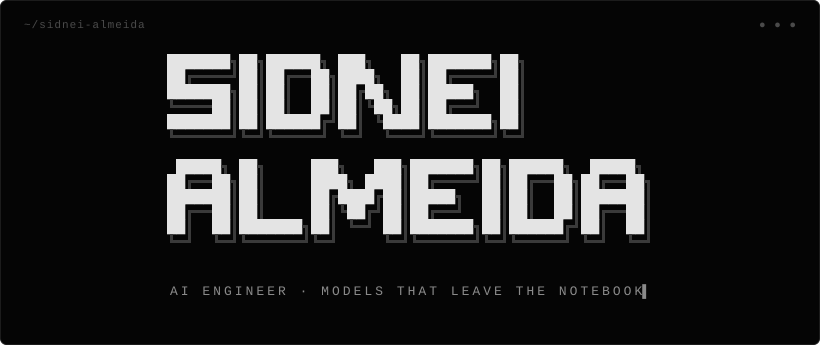

<div align="center">



</div>

```text
┌─ whoami ───────────────────────────────────────────────────────────────┐
│                                                                        │
│  AI Engineer. I work where models meet systems.                        │
│                                                                        │
│  Computer vision, tabular ML, data pipelines and retrieval-grounded    │
│  LLM workflows, shipped behind APIs and interfaces people actually use.│
│                                                                        │
│  Most of it is quiet work: data you can trust, evaluation you can      │
│  defend, deployments that stay up.                                     │
│                                                                        │
└────────────────────────────────────────────────────────────────────────┘
```

```text
┌─ stack ────────────────────────────────────────────────────────────────┐
│                                                                        │
│  .                                                                     │
│  ├── learn/     python · pytorch · tensorflow · scikit-learn · xgboost │
│  ├── see/       opencv · yolov8                                        │
│  ├── store/     postgresql · sqlite · etl pipelines                    │
│  ├── serve/     fastapi · docker · react · next.js · streamlit         │
│  ├── ground/    rag · langchain · faiss · groq · gemini · ollama       │
│  └── ship/      vercel · hugging face · gcp · aws · firebase           │
│                                                                        │
└────────────────────────────────────────────────────────────────────────┘
```

<br/>

### `$ ls deployed/`

| | | | |
| :---: | :--- | :--- | :---: |
| `01` | **[DocMind](https://rag-document-qa-assistant.vercel.app/)** | grounded Q&A over documents, every answer tied to its source | [`src`](https://github.com/sidnei-almeida/rag-document-qa-assistant) |
| `02` | **[Industrial Anomaly Monitor](https://industrial-iot-anomaly-monitor.vercel.app/)** | autoencoder watching a replayed sensor stream | [`src`](https://github.com/sidnei-almeida/industrial-iot-anomaly-monitor) |
| `03` | **[PlatePulse](https://platepulse-vehicle-intelligence.vercel.app/)** | two-stage ALPR for Brazilian plates, YOLOv8 then OCR | [`src`](https://github.com/sidnei-almeida/platepulse-vehicle-intelligence) |
| `04` | **[Corporate Signal](https://corporate-signal-intelligence-dashb.vercel.app/)** | anomalous company events, turned into executive briefings | [`src`](https://github.com/sidnei-almeida/corporate-signal-intelligence-dashboard) |
| `05` | **[PM Monitor](https://lstm-predictive-maintenance-dashboa.vercel.app/)** | rolling LSTM, multivariate sensors into failure probability | [`src`](https://github.com/sidnei-almeida/lstm-predictive-maintenance-dashboard) |
| `06` | **[Visual Anomaly Lab](https://visual-anomaly-comparison-lab.vercel.app/)** | denoising autoencoder with heatmaps that explain the defect | [`src`](https://github.com/sidnei-almeida/visual-anomaly-comparison-lab) |
| `07` | **[CineScope](https://cinescope-semantic-discovery.vercel.app/)** | semantic film search by theme and mood | [`src`](https://github.com/sidnei-almeida/tmdb-semantic-recommender) |
| `08` | **[Gray Matter LABS](https://gray-matter-research-agent.vercel.app/)** | research agent over arXiv, web and Wikipedia | [`src`](https://github.com/sidnei-almeida/gray-matter-research-agent) |
| `09` | **[RL Portfolio Ops](https://ai-trading-signals-dashboard.vercel.app/)** | PPO allocation policies under risk guardrails | [`src`](https://github.com/sidnei-almeida/ai-trading-signals-dashboard) |

<sub>Nine live URLs, zero notebooks. Name opens the demo, <code>src</code> opens the repository. Write-ups at <a href="https://sidnei-almeida.github.io/projects">sidnei-almeida.github.io/projects</a>.</sub>

<br/>

```text
┌─ method ───────────────────────────────────────────────────────────────┐
│                                                                        │
│  01  frame       outcomes, latency budgets, drift risk, labeling cost  │
│  02  land        schemas, leakage, reconciliation, repeatable ingestion│
│  03  transform   features that match train and inference payloads      │
│  04  evaluate    baselines first, metrics aligned with failure modes   │
│  05  wire        thin services, contracts that are easy to test        │
│  06  ship        deploy, observe, patch data, refresh models           │
│                                                                        │
└────────────────────────────────────────────────────────────────────────┘
```

```text
┌─ contact ──────────────────────────────────────────────────────────────┐
│                                                                        │
│  portfolio   sidnei-almeida.github.io                                  │
│  linkedin    linkedin.com/in/saaelmeida93                              │
│  email       sidnei.almeida1806@gmail.com                              │
│                                                                        │
│  status      open to AI / ML engineering work                          │
│                                                                        │
└────────────────────────────────────────────────────────────────────────┘
```

<div align="center">

<sub><a href="https://sidnei-almeida.github.io/">portfolio</a>&nbsp;&nbsp;·&nbsp;&nbsp;<a href="https://www.linkedin.com/in/saaelmeida93/">linkedin</a>&nbsp;&nbsp;·&nbsp;&nbsp;<a href="mailto:sidnei.almeida1806@gmail.com">email</a></sub>

</div>
