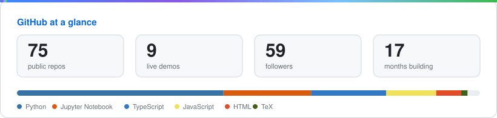

 

# Sidnei Almeida

**AI Engineer**

Models that leave the notebook.

 

<a href="https://sidnei-almeida.github.io/">Portfolio</a>&nbsp;&nbsp;·&nbsp;&nbsp;<a href="https://www.linkedin.com/in/saaelmeida93/">LinkedIn</a>&nbsp;&nbsp;·&nbsp;&nbsp;<a href="mailto:sidnei.almeida1806@gmail.com">Email</a>

 

 

I work where models meet systems. Computer vision, tabular ML, data pipelines and retrieval-grounded LLM workflows, shipped behind APIs and interfaces people actually use.

Most of it is quiet work: data you can trust, evaluation you can defend, deployments that stay up.

 

`Python` &nbsp; `PyTorch` &nbsp; `TensorFlow` &nbsp; `FastAPI` &nbsp; `PostgreSQL` &nbsp; `React` &nbsp; `Docker`

 

## Selected work

| | | |
| :--- | :--- | :---: |
| **[DocMind](https://rag-document-qa-assistant.vercel.app/)** | Grounded Q&A over documents, every answer tied to its source | [↗](https://github.com/sidnei-almeida/rag-document-qa-assistant) |
| **[Industrial Anomaly Monitor](https://industrial-iot-anomaly-monitor.vercel.app/)** | Autoencoder watching a live sensor stream | [↗](https://github.com/sidnei-almeida/industrial-iot-anomaly-monitor) |
| **[PlatePulse](https://platepulse-vehicle-intelligence.vercel.app/)** | Two-stage ALPR for Brazilian plates | [↗](https://github.com/sidnei-almeida/platepulse-vehicle-intelligence) |
| **[Corporate Signal](https://corporate-signal-intelligence-dashb.vercel.app/)** | Anomalous company events, turned into briefings | [↗](https://github.com/sidnei-almeida/corporate-signal-intelligence-dashboard) |
| **[PM Monitor](https://lstm-predictive-maintenance-dashboa.vercel.app/)** | LSTM failure probability from multivariate sensors | [↗](https://github.com/sidnei-almeida/lstm-predictive-maintenance-dashboard) |
| **[Visual Anomaly Lab](https://visual-anomaly-comparison-lab.vercel.app/)** | Defect heatmaps from a denoising autoencoder | [↗](https://github.com/sidnei-almeida/visual-anomaly-comparison-lab) |
| **[CineScope](https://cinescope-semantic-discovery.vercel.app/)** | Semantic film search by theme and mood | [↗](https://github.com/sidnei-almeida/tmdb-semantic-recommender) |
| **[Gray Matter LABS](https://gray-matter-research-agent.vercel.app/)** | Research agent over arXiv, web and Wikipedia | [↗](https://github.com/sidnei-almeida/gray-matter-research-agent) |
| **[RL Portfolio Ops](https://ai-trading-signals-dashboard.vercel.app/)** | PPO allocation under risk guardrails | [↗](https://github.com/sidnei-almeida/ai-trading-signals-dashboard) |

Nine deployed demos. Each one a live URL, not a notebook. Write-ups at <a href="https://sidnei-almeida.github.io/projects">sidnei-almeida.github.io/projects</a>.

 

<picture>
<source media="(prefers-color-scheme: dark)" srcset="./assets/readme/github-stats-dark.svg"/>

</picture>

  

Open to AI / ML engineering work.

 

